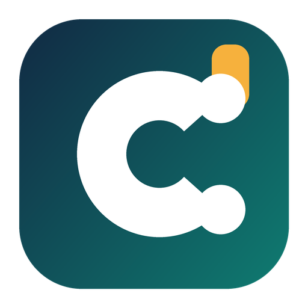

# CodeWF

CodeWF is the website source repository for `dotnet9.com` / `codewf.com`.

Chinese version: [README-zh_CN.md](./README-zh_CN.md)
Changelog: [CHANGELOG.md](./CHANGELOG.md)

The site is built with ASP.NET Core Razor Pages and uses the sibling repository `Assets.Dotnet9` as a file-based content store. Articles, docs, timelines, tool metadata, images, and site-level markdown pages are all loaded from that repository at runtime.

## Logo



The logo is built around a C-shaped site mark: the heavy white `C` directly echoes the CodeWF brand initial, the deep ink-green base represents long-lived technical content, and the yellow block acts as a bookmark accent to keep the reading identity of the blog. The shape deliberately avoids extra detail so 16px browser tabs and bookmarks still keep three clear blocks: the dark base, white C, and yellow bookmark.

The root-level `logo.svg`, `logo.png`, and `logo.ico` files are the single source for logo maintenance. Runtime `/logo.svg`, `/logo.png`, and `/logo.ico` are served from those files, while legacy `/favicon.ico` and `/favicon.png` URLs remain compatible redirects to the new logo.

## Repositories

- Website source (local): `D:\github\owner\CodeWF`
- Content and assets (local): `D:\github\owner\Assets.Dotnet9`
- Website source (GitHub): [https://github.com/dotnet9/CodeWF](https://github.com/dotnet9/CodeWF)
- Content and assets (GitHub): [https://github.com/dotnet9/Assets.Dotnet9](https://github.com/dotnet9/Assets.Dotnet9)

## Stack

- .NET 11
- ASP.NET Core Razor Pages
- Bootstrap
- Markdig
- File-based content loading from local assets

## Directory Layout

```text
src/WebApp/
  Components/        View components
  Controllers/       MVC controllers
  Models/            Content and page models
  Pages/             Razor Pages
  Services/          Content loading, search, and site services
  wwwroot/           Static assets for the app itself

tests/WebApp.Tests/
  AppServiceTests.cs Minimal regression tests
```

## How Content Is Loaded

`AppService` reads content from the local assets directory configured by `Site:LocalAssetsDir`.
When `Site:LocalI8NAssetsDir` is configured, generated article translations are stored outside the assets repository under `Site:LocalI8NAssetsDir/{lang}/YYYY/MM/`.

Main inputs:

- `site/albums.json`
- `site/categories.json`
- `site/friend-links.json`
- `site/timelines.json`
- `site/doc/navigation.json`
- `site/tools/tools.json`
- `site/search-keywords.json`
- `site/blocked-search-keywords.json`
- `site/about.md`
- `site/pays/Donation.md`
- `2019/` to current year article markdown trees, with matching `.yml` metadata sidecars

Common public routes:

- `/post` all posts
- `/project` project/doc center
- `/tool` tool directory
- `/s` search
- `/blog` legacy blog route
- `/search` legacy search route
- `/doc` legacy doc route
- `/sitemap` and `/sitemap.xml` sitemap

## Local Development

1. Clone both repositories side by side.
2. Make sure `src/WebApp/appsettings.json` points `Site:LocalAssetsDir` to your local `Assets.Dotnet9` path and `Site:LocalI8NAssetsDir` to a separate local translation cache path.
3. Run:

```powershell
cd D:\github\owner\CodeWF\src\WebApp
dotnet run
```

## Developer Workflow

In development, `AppService` uses `FileSystemWatcher` to monitor markdown, JSON, and common image assets under the content repository and automatically invalidates in-memory caches.

That means you can:

- edit articles without restarting the app
- tweak categories, docs, or navigation and refresh immediately
- update content images and verify page output quickly

Note: `site/search-keywords.json` is updated by live searches and intentionally does not invalidate all site caches.

## Tests and CI

The repository now includes a minimal safety net:

- GitHub Actions build check: `.github/workflows/build.yml`
- xUnit regression tests: `tests/WebApp.Tests`

Current tests cover:

- article sidecar metadata parsing
- markdown-to-HTML conversion
- blocked search keyword handling

Run locally:

```powershell
dotnet test D:\github\owner\CodeWF\CodeWF.slnx
```

## Configuration

Do not commit real secrets into tracked config files.

Recommended overrides:

- `OpenAI__Key`
- `OpenAI__Endpoint`
- `OpenAI__ChatModel`
- `Site__LocalAssetsDir`
- `Site__LocalI8NAssetsDir`
- `Site__Domain`

Example PowerShell session:

```powershell
$env:Site__LocalAssetsDir = "D:\github\owner\Assets.Dotnet9"
$env:Site__LocalI8NAssetsDir = "D:\github\owner\Assets.Dotnet9.I8N"
$env:OpenAI__Key = "your-real-key"
dotnet run --project D:\github\owner\CodeWF\src\WebApp
```

## Content Workflow

1. Add or update markdown/images in `Assets.Dotnet9`.
2. Keep each article body in `YYYY/MM/slug.md` and its metadata in `YYYY/MM/slug.yml`.
3. Keep article metadata complete: `title`, `slug`, `description`, `date`, `categories`, and `cover`.
4. Update `site/*.json` when categories, albums, docs, tools, or friend links change.
5. Do not maintain generated non-default article translations in the assets repository. They belong under `LocalI8NAssetsDir/{lang}/YYYY/MM/slug.{yyyyMMddHHmmss}.md` and `.yml`.
6. Run the site locally and verify the related page renders correctly.

## Professional Repo Checklist

- Keep content source and app source responsibilities separate.
- Keep tracked config files secret-free.
- Prefer explicit metadata over implicit conventions.
- Document content structure before scaling contributors.
- Verify homepage, listing pages, and detail pages after content changes.
