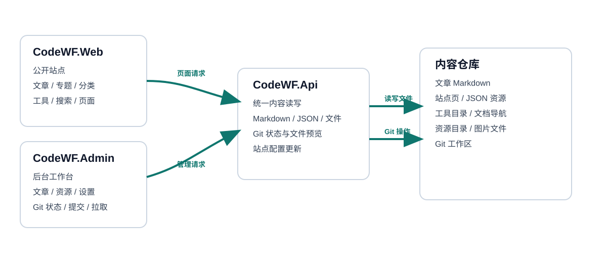
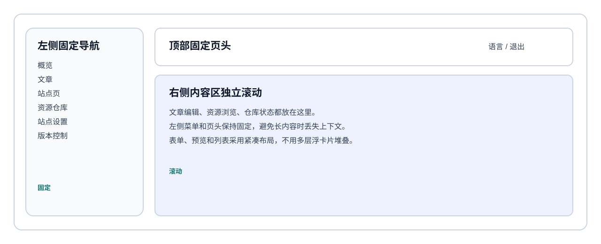

# CodeWF 架构说明

本文档说明当前解决方案的总体架构、请求流和代码边界。详细实现请参考：

- [解决方案总览](solution-overview.md)
- [详细设计](detailed-design.md)
- [目录结构](repo-structure.md)

## 总体结构



CodeWF 采用文件仓库驱动模式，内容、资源和配置都落在仓库与本地目录中，不引入数据库作为主存储。

### 组成

1. `CodeWF.Web`
   - 面向访客的公开站点。
   - 负责文章、专题、分类、工具、搜索、页面渲染。
2. `CodeWF.Admin`
   - React + Ant Design 后台。
   - 负责文章维护、站点页编辑、资源仓库浏览、站点设置、Git 状态查看。
3. `CodeWF.Api`
   - ASP.NET Core API。
   - 负责统一读取和写入文件内容，向前端暴露内容查询和管理接口。
4. 内容仓库
   - 文章、站点页、工具树、友情链接、时间线、分类、专题、文档导航等均为文件。
   - 本地资源目录由 `Site.LocalAssetsDir` 指定，默认指向仓库中的资产路径。

## 请求流

公开站点和后台前端都只通过 API 访问内容，不直接解析仓库文件。

```text
浏览器 -> Web / Admin -> Api -> 文件仓库
```

### 关键约束

- 文章和页面编辑必须保留 Markdown 原文。
- JSON 资源必须可直接读取和保存。
- 资源浏览需要支持目录列表、文本预览、图片预览。
- 版本控制需要展示结构化状态，而不是只给原始 `git status` 文本。

## 管理端布局



后台采用固定左侧导航、固定页头、右侧独立滚动区的结构。这样可以在内容较长时保持导航和上下文稳定。

