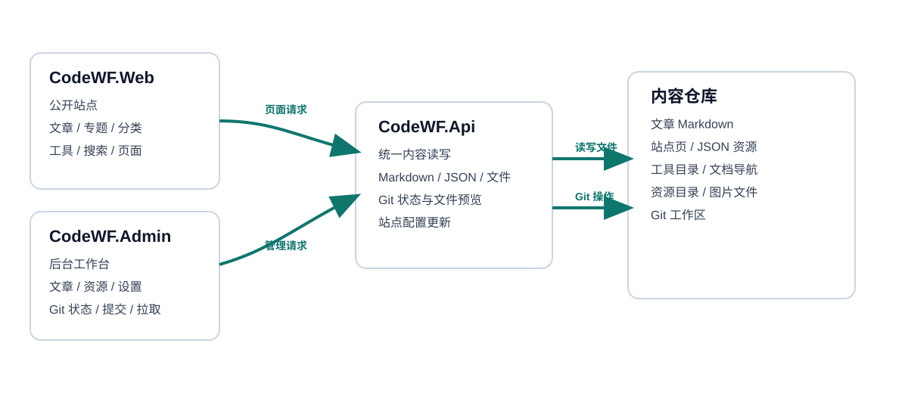

# CodeWF 架构说明

本文档说明当前解决方案的总体架构、请求流和代码边界。详细实现请参考：

- [解决方案总览](solution-overview.md)
- [详细设计](detailed-design.md)
- [目录结构](repo-structure.md)

## 总体结构



CodeWF 采用文件仓库驱动模式，内容、资源和配置都落在仓库与本地目录中，不引入数据库作为主存储。

### 组成

1. `CodeWF.Web`
   - 面向访客的公开站点。
   - 负责文章、专题、分类、搜索与页面渲染。
2. `CodeWF.Api`
   - ASP.NET Core API。
   - 负责统一读取文件内容，向前端暴露公开内容查询接口。
3. 内容仓库
   - 文章、站点页、友情链接、时间线、分类、专题、文档导航等均为文件。
   - 本地资源目录由 `Site.LocalAssetsDir` 指定，默认指向仓库中的资产路径。

## 请求流

公开站点只通过 API 访问内容，不直接解析仓库文件。

```text
浏览器 -> Web -> Api -> 文件仓库
```

### 关键约束

- 文章内容由 Markdown 与同名 `.yml` 元数据驱动，渲染在服务端完成。
- RSS 与 sitemap 必须与站点当前内容保持一致。
- 内容仓库既支持行内 Front Matter，也支持独立元数据文件。

